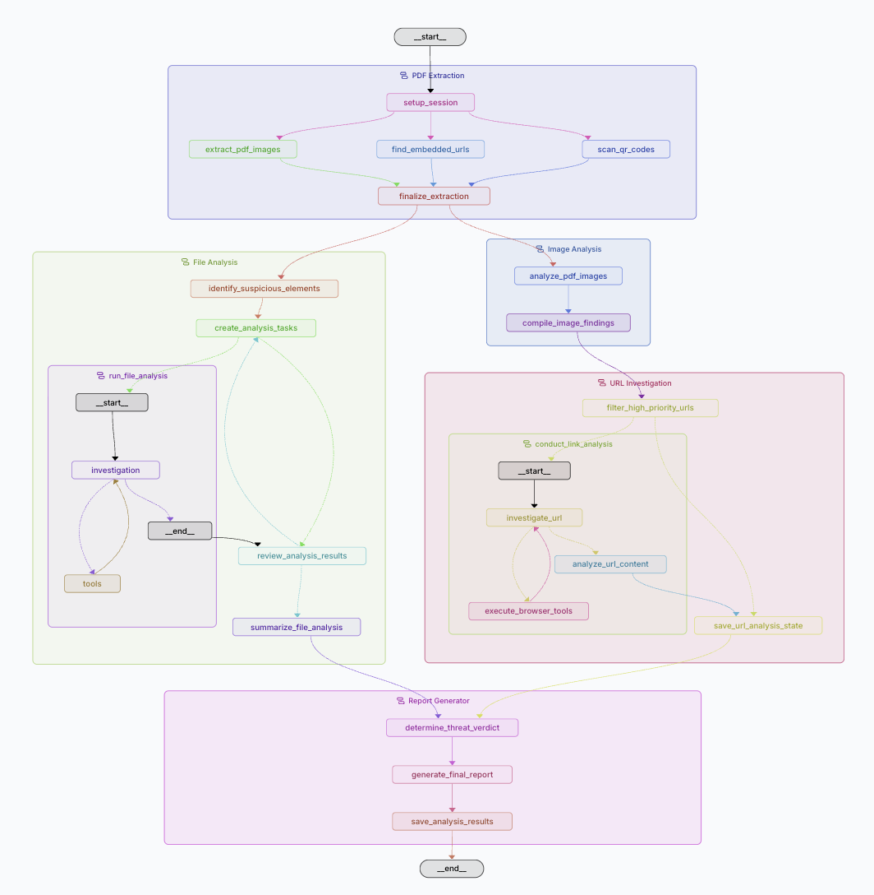

# 🕵️ PDF Hunter

**Advanced Multi-Agent AI Framework for PDF Threat Analysis**

PDF Hunter is a sophisticated threat hunting framework that uses multiple AI agents to analyze potentially malicious PDFs. Built with Python 3.11+ and LangGraph, it employs a multi-agent orchestration pattern with specialized agents for comprehensive PDF analysis and automated report generation.

## 🎯 Core Philosophy

The system operates under three core principles:

1. **Autonomy is Disease**: Any automatic action capability in a PDF (e.g., /OpenAction, /JavaScript, /Launch, /AA, /EmbeddedFile) is high-signal and prioritized for investigation
2. **Deception is Confession**: Visual and structural inconsistencies are treated as confessions of malicious intent
3. **Incoherence is a Symptom**: Cross-page and cross-modal incoherence elevates suspicion

### Research Foundations

This architecture synthesizes insights from multiple security research domains:

- **Deception Theory & Social Engineering**: Visual manipulation patterns, psychological triggers, dark patterns in phishing campaigns
- **Cognitive Bias & Decision-Making**: How attackers exploit human cognitive vulnerabilities through urgency, authority, and fear
- **PDF Malware Analysis Research**: Attack vectors, exploitation techniques, obfuscation patterns documented in CVE databases and threat intelligence
- **Incident Response Patterns**: Real-world attack chains observed in phishing campaigns, malware delivery, and targeted attacks
- **Cross-Modal Forensics**: Detecting inconsistencies between visual presentation, document structure, and embedded metadata

The agent behaviors, prompt engineering, and threat detection heuristics were designed to address the most prevalent attack patterns while maintaining low false-positive rates through balanced "deception vs. coherence" analysis frameworks.

## 🏗️ Architecture Overview

PDF Hunter uses a sophisticated 5-agent pipeline orchestrated via LangGraph:



### Agent Capabilities

- **🔍 PDF Extraction**: Extract metadata, images, URLs (annotations + text + XMP metadata), QR codes safely
- **🧬 File Analysis**: Multi-tool PDF scanning (pdfid, pdf-parser, peepdf, XMP provenance) with mission-based investigations and strategic reflection
- **👁️ Image Analysis**: Visual deception detection, document provenance assessment, and URL prioritization
- **🌐 URL Investigation**: Automated web reconnaissance with strategic reflection and hard-limit resource management
- **📊 Report Generator**: Comprehensive report generation and final verdict determination

### Key Features

- **🧠 Strategic Reflection**: Integrated think_tool for systematic investigation decision-making
- **📊 Structured Logging**: Loguru-based logging with JSONL output for monitoring and analysis
- **🔄 Sophisticated Orchestration**: Parallel agent execution with state aggregation
- **📁 Session Management**: Organized output with session-specific directory structures
- **🛡️ Safe Analysis**: No PDF execution, only static and visual analysis techniques

## 🚀 Quick Start

### Installation Options

Choose the installation method that works best for you:

#### Option 1: Docker (Recommended - Production Ready) 🐳

**Complete web application with one command - no manual setup required!**

```bash
# Clone, configure, and start
git clone https://github.com/goreliks/pdf-hunter.git
cd pdf-hunter
cp .env.example .env
# Edit .env and add your OPENAI_API_KEY

docker-compose up -d

# Access the web dashboard at:
# http://localhost
```

**What you get:**
- ✅ Backend (FastAPI + LangGraph agents) on port 8000
- ✅ Frontend (React web dashboard) on port 80
- ✅ Real-time analysis streaming via SSE
- ✅ Zero configuration - everything just works!

**Docker Management:**
```bash
# View logs
docker-compose logs -f

# Stop services
docker-compose down

# Rebuild after code changes
docker-compose up -d --build
```

---

#### Option 2: Automated Installation Script (macOS/Linux Development)

**For local development with manual control over services:**

```bash
# Clone the repository
git clone https://github.com/goreliks/pdf-hunter.git
cd pdf-hunter

# Run the installation script
./install.sh
```

**The script will:**
- ✅ Check Python 3.11.x version
- ✅ Offer to install zbar (QR code detection library)
- ✅ Install backend dependencies (Python packages via uv)
- ✅ Install Playwright browsers
- ✅ Install frontend dependencies (React/Vite)
- ✅ Optionally build frontend for production
- ✅ Run verification to confirm everything works

Note (developer-friendly install details):
- The installer will ensure `uv` is available and updates PATH to include `$HOME/.local/bin` so subsequent `uv` commands work in the same shell.
- Node.js: the installer prefers Node 20.x (LTS). If your system Node is older (<18) it will install Node 20.x via NodeSource on Linux. Please keep Node >= 18 for Playwright compatibility.
- System libraries: for OpenCV/QR code support the script installs common system libs on Debian/Ubuntu (libgl1-mesa-glx, libglib2.0-0, libzbar0, libzbar-dev). On macOS it suggests `brew install zbar`.
- peepdf-3: we install peepdf-3 without native stpyv8 (using `--no-deps`) to avoid pulling problematic native V8 bindings — this is intentional because we only need peepdf's static parsing features.
- Playwright: browsers are installed automatically, but Playwright may warn about additional host libraries on some Linux distributions. If that happens run `npx playwright install-deps` or install the listed host packages (libnss3, libatk-bridge2.0-0, libxkbcommon0, libgbm1, libasound2, etc.).

**After installation, start the services manually:**

Open two terminal windows:

```bash
# Terminal 1 - Start Backend (FastAPI server)
uv run python -m pdf_hunter.api.server

# Terminal 2 - Start Frontend (Vite dev server)
cd frontend && npm run dev
```

**Access the web dashboard:**
```
http://localhost:5173
```

**To stop services:**
- Press `Ctrl+C` in each terminal window

---

#### Option 3: Manual Installation (Full Control)

**Prerequisites:**
- **Python**: 3.11.x (strictly required, Python 3.12+ not supported)
- **Node.js**: 16+ (for Playwright MCP server)
- **uv**: Python package manager ([install guide](https://docs.astral.sh/uv/getting-started/installation/))

**System Dependencies (Required):**

**macOS:**
```bash
brew install zbar  # Required for QR code detection
```

**Ubuntu/Debian:**
```bash
sudo apt-get install libzbar0 libzbar-dev  # Required for QR code detection
sudo apt-get install libgl1-mesa-glx libglib2.0-0  # Required for OpenCV
```

**RHEL/CentOS/Fedora:**
```bash
sudo dnf install zbar zbar-devel  # Required for QR code detection
sudo dnf install mesa-libGL glib2  # Required for OpenCV
```

**Windows:**
```powershell
# Using vcpkg
vcpkg install zbar:x64-windows
```

**Installation Steps:**

1. **Clone the repository**
   ```bash
   git clone https://github.com/goreliks/pdf-hunter.git
   cd pdf-hunter
   ```

2. **Install Python dependencies**
   ```bash
   # Recommended: Install with all features
   uv sync --group dev --group api
   
   # Or basic installation only
   uv sync
   
   # Install peepdf-3 without dependencies (skip stpyv8 which isn't needed)
   uv pip install --no-deps peepdf-3==5.1.1
   ```

3. **Install Node.js dependencies** 
   ```bash
   # Install Playwright MCP server
   npm install
   
   # Install Playwright browser (REQUIRED)
   npx playwright install chromium
   ```

4. **Configure environment variables**
   ```bash
   cp .env.example .env
   # Edit .env with your API keys
   ```

5. **Verify installation**
   ```bash
   # Run verification script (recommended)
   uv run python verify_installation.py
   ```

### Verify Your Installation

After installation (any method), run the verification script:

```bash
uv run python verify_installation.py
```

This checks:
- ✅ Python version (3.11.x)
- ✅ All Python packages installed correctly
- ✅ System libraries (zbar) accessible
- ✅ Playwright browsers installed
- ✅ MCP server configuration

### Environment Configuration

Create a `.env` file with the required variables for your chosen AI provider:

**For OpenAI (Default):**
```bash
# Required: OpenAI API key for LLM operations
OPENAI_API_KEY="your_openai_api_key_here"
```

**For Azure OpenAI (Enterprise):**
```bash
# Required: Azure OpenAI configuration
AZURE_OPENAI_ENDPOINT="https://your-resource.openai.azure.com/"
AZURE_OPENAI_API_KEY="your_azure_openai_api_key_here"
AZURE_OPENAI_DEPLOYMENT_NAME="your_deployment_name_here"
AZURE_OPENAI_API_VERSION="2024-12-01-preview"  # Optional
```

**Optional: Advanced features**
```bash
ANTHROPIC_API_KEY="your_anthropic_api_key_here"
LANGSMITH_API_KEY="your_langsmith_api_key_here"
LANGSMITH_TRACING_V2=true
LANGSMITH_PROJECT="pdf-hunter"
TAVILY_API_KEY="your_tavily_api_key_here"
```

### Model Configuration

PDF Hunter supports multiple AI model providers:

**🤖 OpenAI (Default)**
- Uses `gpt-4o` for all analysis tasks
- Requires OpenAI API key
- Best reliability and performance

**☁️ Azure OpenAI (Enterprise)**
- Uses `gpt-4o` via Azure deployment
- Requires Azure OpenAI resource and configuration
- Enterprise features, data residency, enhanced security
- Ideal for corporate deployments

**🏠 Ollama (Local Alternative)**
- Uses Qwen2.5:7b and Qwen2.5-VL:7b locally
- No API keys required
- Edit `src/pdf_hunter/config/models_config.py` to enable

To switch between providers, update the LLM initializations in `src/pdf_hunter/config/models_config.py` to use the desired configuration dictionary (e.g., `openai_config`, `azure_openai_config`).

## 🎮 Usage

### Basic Analysis

Analyze a PDF with the complete orchestrator:

```bash
# Run with defaults (hello_qr_and_link.pdf, 4 pages)
uv run python -m pdf_hunter.orchestrator.graph

# Analyze specific file with options
uv run python -m pdf_hunter.orchestrator.graph --file test_mal_one.pdf --pages 2

# With additional context
uv run python -m pdf_hunter.orchestrator.graph --file suspicious.pdf --context "Received from unknown email"

# Enable debug logging
uv run python -m pdf_hunter.orchestrator.graph --debug

# Get help
uv run python -m pdf_hunter.orchestrator.graph --help
```

### Individual Agent Testing

Run agents in isolation for development and testing. Each agent has a dedicated CLI module with specific options:

```bash
# PDF Extraction - Extract images, URLs, and QR codes
uv run python -m pdf_hunter.agents.pdf_extraction.graph --file hello_qr_and_link.pdf --pages 1

# Image Analysis - Visual deception analysis
uv run python -m pdf_hunter.agents.image_analysis.graph --file test_mal_one.pdf --pages 3

# File Analysis - Static analysis and threat investigation
uv run python -m pdf_hunter.agents.file_analysis.graph --file suspicious.pdf --context "Phishing campaign"

# URL Investigation - Test with custom URLs
uv run python -m pdf_hunter.agents.url_investigation.graph --url https://example.com --url https://test.com

# Report Generator - Generate reports from existing analysis
uv run python -m pdf_hunter.agents.report_generator.graph --state /path/to/analysis_state.json

# Get help for any agent
uv run python -m pdf_hunter.agents.pdf_extraction.graph --help
```

### CLI Arguments

**Common arguments (available for most agents):**
- `--file/-f`: PDF file to analyze (relative or absolute path)
- `--pages/-p`: Number of pages to process
- `--output/-o`: Output directory for results
- `--debug`: Enable debug logging to terminal

**Agent-specific arguments:**
- **Orchestrator & File Analysis**: `--context/-c` - Additional context about the PDF
- **File Analysis**: `--session/-s` - Custom session ID
- **URL Investigation**: `--url/-u` - URL to investigate (can be specified multiple times)
- **Report Generator**: 
  - `--state/-s` - Path to analysis state JSON file
  - `--search-dir/-d` - Directory to search for state files

**Path Handling:**
- Relative filenames automatically resolve to `tests/assets/pdfs/`
- Absolute paths are used directly
- Output paths support both relative and absolute paths


### LangGraph Platform Deployment

Deploy all graphs as APIs:

```bash
langgraph up
```

This starts a web server with endpoints for each agent graph. PDF Hunter is fully compatible with LangGraph Studio thanks to its non-blocking async architecture that ensures all I/O operations run properly in the event-loop-based environment.

### Development Environment

Launch Jupyter for interactive development:

```bash
jupyter lab notebooks/development/
```

## 📁 File Organization

### Test Assets

PDF Hunter organizes test files in a structured directory hierarchy:

```
tests/
├── agents/                  # Agent-specific tests (error handling, XMP integration)
├── api/                     # API server and SSE streaming tests
└── assets/                  # Organized test assets
    ├── pdfs/                # PDF test files
    │   ├── hello_qr.pdf     # QR code test samples
    │   ├── hello_qr_and_link.pdf
    │   ├── test_mal_one.pdf # Malicious PDF sample
    │   └── *.pdf            # Additional test PDFs
    └── images/              # Test images
        └── qrmonkey.jpg     # QR code test image
```

### Output Organization

PDF Hunter creates session-based output directories:

```
output/
├── {sha1}_{timestamp}/          # Session-specific analysis
│   ├── pdf_extraction/          # Extracted images, metadata
│   ├── file_analysis/           # Evidence graphs, mission reports
│   ├── image_analysis/          # Visual deception analysis
│   ├── url_investigation/       # URL reconnaissance reports
│   └── report_generator/        # Final reports and verdicts
│       ├── final_report_session_{id}.md
│       └── final_state_session_{id}.json
```

## 🔧 Configuration

### Logging Configuration

PDF Hunter uses **Loguru** for structured logging with multiple output streams:

**Output Streams:**
- **Terminal**: Colorful, human-readable with emojis (INFO+ by default, DEBUG+ in development mode)
- **Central Log**: `logs/pdf_hunter_YYYYMMDD.jsonl` - All sessions, daily rotation, structured JSONL format
- **Session Log**: `output/{session_id}/logs/session.jsonl` - Session-specific logs, structured JSONL format

**Basic Usage:**

```python
# Import in any module
from loguru import logger

# Log with structured context
logger.info("Starting extraction",
            agent="PdfExtraction",
            node="extract_images",
            session_id=session_id)

# Success events
logger.success("✅ Extraction complete",
               image_count=len(images))

# Errors with automatic traceback
logger.exception("❌ Operation failed")
```

**Configuration:**

```python
from pdf_hunter.config.logging_config import setup_logging

# Production mode (INFO+ in terminal, all logs in files)
setup_logging(session_id=session_id, output_directory=output_dir)

# Development mode (DEBUG+ in terminal)
setup_logging(debug_to_terminal=True)
```

**Log File Structure:**

Each log entry in JSONL files includes structured fields:
- `record.extra.agent` - Agent identifier (PdfExtraction, FileAnalysis, etc.)
- `record.extra.node` - Node function name
- `record.extra.session_id` - Session identifier
- `record.extra.event_type` - Optional semantic event type
- `record.level.name` - Log level (DEBUG, INFO, SUCCESS, WARNING, ERROR, CRITICAL)
- `record.message` - Human-readable message
- `record.time.timestamp` - Unix timestamp

For complete field mappings and event types, see `docs/LOGGING_FIELD_REFERENCE.md`.

### Investigation Enhancement Configuration

PDF Hunter includes an optional strategic reflection system:

```python
# In src/pdf_hunter/config/execution_config.py
THINKING_TOOL_ENABLED = True  # Enable strategic reflection tool
```

When enabled, the think_tool provides:
- **Strategic Reflection**: Systematic pause-and-reflect during investigations
- **Decision Quality**: Enhanced investigation thoroughness through deliberate analysis
- **Investigation Transparency**: Clear reasoning trails in logs for debugging
- **Configurable**: Can be disabled for streamlined operation when not needed

The think_tool is automatically integrated into file analysis and URL investigation agents when enabled, providing strategic reflection capabilities without requiring code changes.

### LLM Configuration

PDF Hunter uses 10 specialized LLM instances optimized for different tasks:

- **Tool-Using Models**: Function calling for PDF analysis and web reconnaissance
- **Structured Output Models**: Pydantic schema generation for consistent data
- **Analysis Models**: Raw data processing (triage, investigation)
- **Synthesis Models**: High-level reasoning (review, finalization)

Configure in `src/pdf_hunter/config/models_config.py`:

```python
# Example: Switch to Ollama for local inference
# Uncomment Ollama configuration and update LLM initializations:
# file_analysis_triage_llm = init_chat_model(**ollama_config)
```

### Platform Configuration

LangGraph platform configuration in `langgraph.json`:

```json
{
    "dependencies": ["."],
    "graphs": {
        "file_analysis": "pdf_hunter.agents.file_analysis.graph:file_analysis_graph",
        "pdf_extraction": "pdf_hunter.agents.pdf_extraction.graph:pdf_extraction_graph", 
        "orchestrator": "pdf_hunter.orchestrator.graph:orchestrator_graph",
        "url_investigation": "pdf_hunter.agents.url_investigation.graph:url_investigation_graph"
    },
    "env": ".env"
}
```

## 🧪 Testing

### Sample PDFs

Test files are included in `tests/`:

- `hello_qr.pdf` / `hello_qr_and_link.pdf`: QR code test cases
- `test_mal_one.pdf`: Malicious PDF sample
- Various threat pattern samples for regression testing

### Running Tests

```bash
# Run unit tests (when available)
uv run pytest

# Test individual components
uv run python -m pdf_hunter.agents.pdf_extraction.graph
```

## 🛠️ Development

### Architecture

- **src-layout**: Standard Python package structure
- **LangGraph**: Multi-agent workflow orchestration
- **Pydantic**: Type-safe data models and validation
- **MCP**: Browser automation via Model Context Protocol
- **Async Programming**: Non-blocking I/O for LangGraph Studio compatibility

### Async Programming Pattern

PDF Hunter uses async/await patterns to ensure compatibility with LangGraph Studio:

```python
# All agent node functions must be async
async def analyze_file(state):
    # Use await for LLM calls
    result = await llm.ainvoke({"messages": messages})
    
    # Wrap file I/O operations in asyncio.to_thread
    await asyncio.to_thread(os.makedirs, path, exist_ok=True)
    
    # Wrap subprocess calls
    result = await asyncio.to_thread(subprocess.run, cmd, capture_output=True, text=True)
    
    return {"result": result}
```

Key async patterns:
- All agent node functions are async (`async def function_name`)
- LLM invocations use `await llm.ainvoke()` instead of `llm.invoke()`
- File operations wrapped in `asyncio.to_thread(os.makedirs, path, exist_ok=True)`
- Subprocess calls wrapped in `asyncio.to_thread(subprocess.run, ...)`
- State serialization uses async file operations
- MCP integration follows async patterns

### Cross-Platform Compatibility

PDF Hunter uses platform-independent path handling to ensure compatibility across operating systems:

```python
import os

# Get the module's directory
module_dir = os.path.dirname(os.path.abspath(__file__))

# Navigate up to the project root
project_root = os.path.abspath(os.path.join(module_dir, "../../../.."))

# Construct path to test file
file_path = os.path.join(project_root, "tests", "assets", "pdfs", "test_file.pdf")
```

This approach ensures the code works consistently on Windows, Linux, and macOS environments.

### Key Dependencies

**Core Framework:**
- **LangGraph**: Multi-agent orchestration
- **LangChain**: LLM integration and tool binding
- **Pydantic**: Data validation and schemas

**PDF Analysis:**
- **PyMuPDF**: PDF rendering and content extraction
- **peepdf-3**: Enhanced PDF structure analysis
- **pdfid**: PDF structure scanning

**Computer Vision:**
- **OpenCV**: Image processing and QR code detection
- **pyzbar**: QR/barcode decoding
- **Pillow**: Image manipulation
- **imagehash**: Perceptual hashing

**Browser Automation:**
- **@playwright/mcp**: MCP server for browser automation
- **langchain-mcp-adapters**: MCP integration with LangChain

### Development Workflow

1. **Setup development environment**
   ```bash
   uv sync --all-groups
   uv pip install -e .[dev]
   uv pip install --no-deps peepdf-3==5.1.1
   ```

2. **Use Jupyter notebooks for prototyping**
   ```bash
   jupyter lab notebooks/development/
   ```

3. **Test individual agents before integration**

4. **Follow existing patterns for new agents**

## 🔒 Security Considerations

PDF Hunter is a **defensive security tool** designed for safe PDF analysis:

- ✅ Sandboxed PDF parsing using external tools
- ✅ No direct PDF execution or rendering
- ✅ Structured analysis without file modification  
- ✅ Safe command execution with input validation
- ✅ Browser automation in isolated MCP environments
- ✅ Secure state serialization excluding sensitive data

## 📊 Features

### Advanced Capabilities

- **🎯 Multi-Modal Analysis**: Combines structural, visual, and behavioral analysis
- **🤖 AI-Powered Insights**: 10 specialized LLMs for different analysis tasks
- **🧠 Strategic Reflection**: Integrated think_tool for systematic investigation decision-making
- **📊 Structured Logging**: Loguru-based logging with JSONL output for analysis and monitoring
- **🔄 Parallel Processing**: Concurrent analysis for improved performance
- **📈 Evidence Graphs**: Structured representation of attack chains
- **🌐 Web Reconnaissance**: Automated URL investigation with MCP Playwright integration
- **📋 Executive Reports**: Human-readable analysis summaries
- **🔍 QR Code Detection**: Automated QR code extraction and analysis
- **🔬 Document Provenance Analysis**: XMP metadata extraction for tool chain coherence and manipulation detection
- **💾 State Persistence**: Complete analysis state saving for debugging
- **⚡ LangGraph Studio**: Full compatibility with non-blocking async architecture

### Reliability & Error Handling

PDF Hunter implements comprehensive error handling across all 5 agents (~30 node functions):

- **Runtime Resilience**: Universal try-except wrapping prevents crashes from edge cases
- **Input Validation**: Required fields validated at function entry with early failure detection
- **Safe State Access**: Defensive `state.get()` patterns prevent KeyError crashes
- **Error Aggregation**: Standardized error collection through LangGraph state management
- **Test Coverage**: 19 test cases across 5 agents covering missing files, invalid paths, empty data
- **Graceful Degradation**: Partial analysis completion even when individual components fail
- **Recursion Limit Protection**: Specialized handling for `GraphRecursionError` prevents crashes when investigations exceed complexity limits

The system handles common failure scenarios automatically:
- Missing or inaccessible PDF files
- Invalid file paths and permissions
- Empty or malformed data structures
- Tool execution failures
- Network timeouts during URL investigation
- Resource limits (e.g., maximum page processing)
- Investigation recursion limits (complex or stuck investigations)

Advanced features:
- **Mission ID Tracking**: LLM-generated semantic IDs (e.g., `mission_openaction_001`) for consistent investigation tracking
- **Blocked Mission Recovery**: File analysis marks recursion-limited missions as `BLOCKED` for reviewer re-evaluation
- **URL Analysis Continuity**: Failed URL investigations marked as "Inaccessible" with clear context in final report

All errors are logged with context and aggregated in the final analysis state, ensuring transparent failure reporting without system crashes.

### Threat Detection

- **Autonomy Features**: JavaScript, OpenAction, Launch actions, Auto-Actions
- **Embedded Content**: Files, forms, multimedia elements
- **Visual Deception**: Layout inconsistencies, social engineering tactics
- **URL Analysis**: Link reputation, redirection chains, threat indicators
- **Structural Anomalies**: PDF structure irregularities and malformations

## 📚 Documentation

- **CLAUDE.md**: Complete developer guide and architecture documentation
- **notebooks/**: Interactive development and testing examples
- **src/pdf_hunter/**: Inline code documentation and type hints

## 🤝 Contributing

1. Fork the repository
2. Create a feature branch (`git checkout -b feature/amazing-feature`)
3. Commit your changes (`git commit -m 'Add amazing feature'`)
4. Push to the branch (`git push origin feature/amazing-feature`)
5. Open a Pull Request

## 📄 License

This project is licensed under the ISC License - see the [LICENSE](LICENSE) file for details.

## 🙏 Acknowledgments

- Built with [LangGraph](https://www.langchain.com/langgraph) for multi-agent orchestration
- Uses [OpenAI GPT-4o](https://openai.com/) for AI-powered analysis
- PDF analysis powered by [PyMuPDF](https://pymupdf.readthedocs.io/) and [peepdf](https://eternal-todo.com/tools/peepdf-pdf-analysis-tool)
- Browser automation via [Playwright MCP](https://github.com/microsoft/playwright-mcp)

---

**⚠️ Disclaimer**: PDF Hunter is designed for defensive security analysis. Always analyze suspicious files in isolated environments and follow your organization's security policies.
