# 🕵️ PDF Hunter

**Advanced Multi-Agent AI Framework for PDF Threat Analysis**

PDF Hunter is a sophisticated threat hunting framework that uses multiple AI agents to analyze potentially malicious PDFs. Built with Python 3.11+ and LangGraph, it employs a multi-agent orchestration pattern with specialized agents for comprehensive PDF analysis and automated report generation.

## 🎯 Core Philosophy

The system operates under three core principles:

1. **Autonomy is Disease**: Any automatic action capability in a PDF (e.g., /OpenAction, /JavaScript, /Launch, /AA, /EmbeddedFile) is high-signal and prioritized for investigation
2. **Deception is Confession**: Visual and structural inconsistencies are treated as confessions of malicious intent  
3. **Incoherence is a Symptom**: Cross-page and cross-modal incoherence elevates suspicion

## 🏗️ Architecture Overview

PDF Hunter uses a sophisticated 5-agent pipeline orchestrated via LangGraph:

```mermaid
graph TD
    A[📄 PDF Input] --> B[🔍 Preprocessing Agent]
    B --> C[🧬 Static Analysis Agent]
    B --> D[👁️ Visual Analysis Agent]
    C --> E[🌐 Link Analysis Agent]
    D --> E
    E --> F[📊 Finalizer Agent]
    F --> G[📋 Final Report]
```



### Agent Capabilities

- **🔍 Preprocessing**: Extract metadata, images, URLs, QR codes safely
- **🧬 Static Analysis**: Multi-tool PDF scanning with mission-based investigations  
- **👁️ Visual Analysis**: Visual deception detection and URL prioritization
- **🌐 Link Analysis**: Automated web reconnaissance of suspicious URLs
- **📊 Finalizer**: Comprehensive report generation and final verdict

## 🚀 Quick Start

### Prerequisites

- **Python**: 3.11+ (required, <3.12)
- **Node.js**: 16+ (for Playwright MCP server)
- **uv**: Python package manager ([install guide](https://docs.astral.sh/uv/getting-started/installation/))

### Installation

1. **Clone the repository**
   ```bash
   git clone https://github.com/goreliks/pdf-hunter.git
   cd pdf-hunter
   ```

2. **Install Python dependencies**
   ```bash
   # Basic installation
   uv sync
   
   # With development tools (Jupyter notebooks)
   uv sync --group dev
   
   # Optional: vLLM support (Linux/Windows only)
   uv sync --group vllm
   ```

3. **Install Node.js dependencies** 
   ```bash
   npm install
   ```

4. **Configure environment variables**
   ```bash
   cp .env-example .env
   # Edit .env with your API keys
   ```

### Environment Configuration

Create a `.env` file with the following variables:

```bash
# Required: OpenAI API key for LLM operations (default configuration)
OPENAI_API_KEY="your_openai_api_key_here"

# Optional: For advanced features
ANTHROPIC_API_KEY="your_anthropic_api_key_here"
LANGSMITH_API_KEY="your_langsmith_api_key_here"
LANGSMITH_TRACING_V2=true
LANGSMITH_PROJECT="pdf-hunter"
TAVILY_API_KEY="your_tavily_api_key_here"
```

### Model Configuration

PDF Hunter supports multiple AI model providers:

**🤖 OpenAI (Default)**
- Uses `gpt-4o` for all analysis tasks
- Requires OpenAI API key
- Best reliability and performance

**🏠 Ollama (Local Alternative)**
- Uses Qwen2.5:7b and Qwen2.5-VL:7b locally
- No API keys required
- Edit `src/pdf_hunter/config.py` to enable

To switch between providers, uncomment the desired configuration in `src/pdf_hunter/config.py`.

## 🎮 Usage

### Basic Analysis

Analyze a PDF with the complete orchestrator:

```bash
# Run full analysis pipeline
uv run python -m pdf_hunter.orchestrator.graph
```

### Individual Agent Testing

Run agents in isolation for development and testing:

```bash
# Test individual agents
uv run python -m pdf_hunter.agents.preprocessing.graph
uv run python -m pdf_hunter.agents.static_analysis.graph
uv run python -m pdf_hunter.agents.visual_analysis.graph
uv run python -m pdf_hunter.agents.link_analysis.graph
uv run python -m pdf_hunter.agents.finalizer.graph
```

### LangGraph Platform Deployment

Deploy all graphs as APIs:

```bash
langgraph up
```

This starts a web server with endpoints for each agent graph.

### Development Environment

Launch Jupyter for interactive development:

```bash
jupyter lab notebooks/development/
```

## 📁 Output Organization

PDF Hunter creates session-based output directories:

```
output/
├── {sha1}_{timestamp}/          # Session-specific analysis
│   ├── preprocessing/           # Extracted images, metadata
│   ├── static_analysis/         # Evidence graphs, mission reports
│   ├── visual_analysis/         # Visual deception analysis
│   ├── link_analysis/          # URL reconnaissance reports
│   └── finalizer/              # Final reports and verdicts
│       ├── final_report_session_{id}.md
│       └── final_state_session_{id}.json
```

## 🔧 Configuration

### LLM Configuration

PDF Hunter uses 10 specialized LLM instances optimized for different tasks:

- **Tool-Using Models**: Function calling for PDF analysis and web reconnaissance
- **Structured Output Models**: Pydantic schema generation for consistent data
- **Analysis Models**: Raw data processing (triage, investigation)
- **Synthesis Models**: High-level reasoning (review, finalization)

Configure in `src/pdf_hunter/config.py`:

```python
# Example: Switch to Ollama for local inference
model = "qwen2.5vl:7b"
model_provider = "ollama"
```

### Platform Configuration

LangGraph platform configuration in `langgraph.json`:

```json
{
    "dependencies": ["."],
    "graphs": {
        "static_analysis": "pdf_hunter.agents.static_analysis.graph:static_analysis_graph",
        "preprocessing": "pdf_hunter.agents.preprocessing.graph:preprocessing_graph", 
        "orchestrator": "pdf_hunter.orchestrator.graph:orchestrator_graph",
        "link_analysis": "pdf_hunter.agents.link_analysis.graph:link_analysis_graph"
    },
    "env": ".env"
}
```

## 🧪 Testing

### Sample PDFs

Test files are included in `tests/`:

- `hello_qr.pdf` / `hello_qr_and_link.pdf`: QR code test cases
- `test_mal_one.pdf`: Malicious PDF sample
- Various threat pattern samples for regression testing

### Running Tests

```bash
# Run unit tests (when available)
uv run pytest

# Test individual components
uv run python -m pdf_hunter.agents.preprocessing.graph
```

## 🛠️ Development

### Architecture

- **src-layout**: Standard Python package structure
- **LangGraph**: Multi-agent workflow orchestration
- **Pydantic**: Type-safe data models and validation
- **MCP**: Browser automation via Model Context Protocol

### Key Dependencies

**Core Framework:**
- **LangGraph**: Multi-agent orchestration
- **LangChain**: LLM integration and tool binding
- **Pydantic**: Data validation and schemas

**PDF Analysis:**
- **PyMuPDF**: PDF rendering and content extraction
- **peepdf-3**: Enhanced PDF structure analysis
- **pdfid**: PDF structure scanning

**Computer Vision:**
- **OpenCV**: Image processing and QR code detection
- **pyzbar**: QR/barcode decoding
- **Pillow**: Image manipulation
- **imagehash**: Perceptual hashing

**Browser Automation:**
- **@playwright/mcp**: MCP server for browser automation
- **langchain-mcp-adapters**: MCP integration with LangChain

### Development Workflow

1. **Setup development environment**
   ```bash
   uv sync --all-groups
   uv pip install -e .[dev]
   ```

2. **Use Jupyter notebooks for prototyping**
   ```bash
   jupyter lab notebooks/development/
   ```

3. **Test individual agents before integration**

4. **Follow existing patterns for new agents**

## 🔒 Security Considerations

PDF Hunter is a **defensive security tool** designed for safe PDF analysis:

- ✅ Sandboxed PDF parsing using external tools
- ✅ No direct PDF execution or rendering
- ✅ Structured analysis without file modification  
- ✅ Safe command execution with input validation
- ✅ Browser automation in isolated MCP environments
- ✅ Secure state serialization excluding sensitive data

## 📊 Features

### Advanced Capabilities

- **🎯 Multi-Modal Analysis**: Combines structural, visual, and behavioral analysis
- **🤖 AI-Powered Insights**: 10 specialized LLMs for different analysis tasks
- **🔄 Parallel Processing**: Concurrent analysis for improved performance
- **📈 Evidence Graphs**: Structured representation of attack chains
- **🌐 Web Reconnaissance**: Automated URL investigation with browser automation
- **📋 Executive Reports**: Human-readable analysis summaries
- **🔍 QR Code Detection**: Automated QR code extraction and analysis
- **💾 State Persistence**: Complete analysis state saving for debugging

### Threat Detection

- **Autonomy Features**: JavaScript, OpenAction, Launch actions, Auto-Actions
- **Embedded Content**: Files, forms, multimedia elements
- **Visual Deception**: Layout inconsistencies, social engineering tactics
- **URL Analysis**: Link reputation, redirection chains, threat indicators
- **Structural Anomalies**: PDF structure irregularities and malformations

## 📚 Documentation

- **CLAUDE.md**: Complete developer guide and architecture documentation
- **notebooks/**: Interactive development and testing examples
- **src/pdf_hunter/**: Inline code documentation and type hints

## 🤝 Contributing

1. Fork the repository
2. Create a feature branch (`git checkout -b feature/amazing-feature`)
3. Commit your changes (`git commit -m 'Add amazing feature'`)
4. Push to the branch (`git push origin feature/amazing-feature`)
5. Open a Pull Request

## 📄 License

This project is licensed under the ISC License - see the [LICENSE](LICENSE) file for details.

## 🙏 Acknowledgments

- Built with [LangGraph](https://www.langchain.com/langgraph) for multi-agent orchestration
- Uses [OpenAI GPT-4o](https://openai.com/) for AI-powered analysis
- PDF analysis powered by [PyMuPDF](https://pymupdf.readthedocs.io/) and [peepdf](https://eternal-todo.com/tools/peepdf-pdf-analysis-tool)
- Browser automation via [Playwright MCP](https://github.com/microsoft/playwright-mcp)

---

**⚠️ Disclaimer**: PDF Hunter is designed for defensive security analysis. Always analyze suspicious files in isolated environments and follow your organization's security policies.
